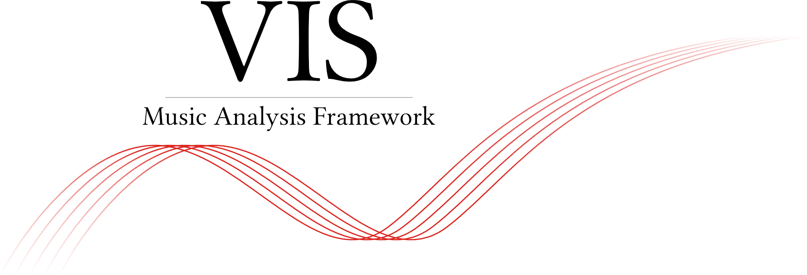

.. vis documentation master file, created by
   sphinx-quickstart on Wed Sep 18 00:06:56 2013.
   You can adapt this file completely to your liking, but it should at least
   contain the root `toctree` directive.

This is the API documentation for the VIS Framework for Music Analysis.
The VIS Framework is a Python package that uses music21 and pandas to build a flexible and easy system for writing symbolic music analysis computer programs.
By providing a free-and-open solution (AGPLv3+) we hope to lower the barrier to empirical music analysis.
The VIS Framework was developed at McGill University as part of the ELVIS Project (http://elvisproject.ca).
VIS has been presented at conferences, including the International Society for Music Information Retrieval and the Society for Music Theory.

About This Documentation
------------------------

The API is written for programmers interested in symbolic music information retrieval (i.e., music theory analysis performed by computers).
Musicologists and programmers alike may access our VIS client at `vis-rodan.simssa.ca <https://vis-rodan.simssa.ca>`_, and some of our research findings from the `ELVIS Project's website <https://elvisproject.ca/research/>`_.

The rest of the documentation discusses the VIS Framework's architecture, how to install and use the framework, and how to add your own analysis tasks.

One-Paragraph Introduction
^^^^^^^^^^^^^^^^^^^^^^^^^^^^^^^^^^

The VIS Framework uses two data models (:class:`~vis.models.indexed_piece.IndexedPiece` and :class:`~vis.models.aggregated_pieces.AggregatedPieces`) to fetch results for one or multiple pieces, respectively.
Call their :meth:`~vis.models.indexed_piece.IndexedPiece.get_data` method with a list of analyzer classes to run, and a dictionary with their settings.
After you develop an analysis workflow, add it to the :class:`~vis.workflow.WorkflowManager` for more consistent operation.

Table of Contents
-----------------

Learn about and Install the VIS Framework
^^^^^^^^^^^^^^^^^^^^^^^^^^^^^^^^^^^^^^^^^
.. toctree::
    :maxdepth: 2

    about
    install_and_test

Programming Tutorials for VIS
^^^^^^^^^^^^^^^^^^^^^^^^^^^^^
.. toctree::
    :maxdepth: 1

    tutorial-melodic_ngrams
    tutorial-workflowmanager

API Specification
^^^^^^^^^^^^^^^^^
.. toctree::
   :maxdepth: 5

   modules

Indices and Tables
^^^^^^^^^^^^^^^^^^
* :ref:`genindex`
* :ref:`modindex`
* :ref:`search`
