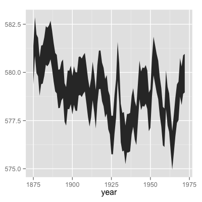

.. _install_and_test:

Install the Framework
---------------------

You must install the VIS Framework before you use it.
Our recommended installation method depends on how you plan to use VIS.

If you plan to use VIS as a program or a library, you should install the Framework for *deployment*.
This includes users who will conduct their own analyses with the built-in modules, and users who will host an instance of the `Counterpoint Web App <https://github.com/ELVIS_Project/web-vis>`_.
A deployment installation will always be "stable" software, meaning that the software has been tested more thoroughly, and we can offer a higher assurance of correctness.

If you plan to use VIS as a framework, you should install the Framework for *development*.
This includes users who will write their own analyzers for the VIS Framework, and users who will modify existing modules.
A development installation allows you to use the most up-to-date versions of VIS, and even to suggest your improvements for inclusion in a VIS release, although these versions may crash more often and be less correct than deployment versions.

You may safely install the VIS Framework multiple times on the same computer, including a mixture of deployment and development installations.

Python 3
^^^^^^^^

With the release of VIS Framework 2.1, VIS can run and is tested with Python 2.7, 3.3, and 3.4.
We recommend a Python 3 release for reasons of future compatibility.
The music21 developers have announced plans to drop support for Python 2.7 in calendar year 2016, at which point VIS will also drop support for Python 2.7.
Python 3.4 offers several major enhancements over Python 3.3, including improved speed of execution, so we recommend you use Python 3.4 if possible.

Install for Deployment
^^^^^^^^^^^^^^^^^^^^^^
You must install the VIS Framework before you use it.
If you will not write extensions for the Framework, you may use ``pip`` to install the package from the Python Package Index (PyPI---`https://pypi.python.org/pypi/vis-framework/ <https://pypi.python.org/pypi/vis-framework/>`_). Run this command::

    $ pip install vis-framework

You may also wish to install some or all of the optional dependencies:

    * ``numexpr`` and ``bottleneck``, which speed up ``pandas``.
    * ``openpyxl``, which allows ``pandas`` to export Excel-format spreadsheets.
    * ``cython`` and ``tables``, which allow ``pandas`` to export HDF5-format binary files.

You may install optional dependencies in the same ways as VIS itself. For example::

    $ pip install numexpr bottleneck

Install for Development
^^^^^^^^^^^^^^^^^^^^^^^
If you wish to install the VIS Framework for development work, we recommend you clone our Git repository from https://github.com/ELVIS-Project/vis/, or even make your own fork on GitHub.
You may also wish to checkout a particular version for development with the "checkout" command, as ``git checkout tags/vis-framework-1.2.3`` or ``git checkout master``.

If you installed git, but you need help to clone a repository, you may find useful information in the `git documentation <http://git-scm.com/book/en/Git-Basics-Getting-a-Git-Repository#Cloning-an-Existing-Repository>`_.

After you clone the VIS repository, you should install its dependencies (listed in the "requirements.py" file), for which we recommend you use ``pip``.
From the main VIS directory, run ``pip install -r requirements.txt`` to automatically download and install the library dependencies.
We also recommend you run ``pip install -r optional_requirements.txt`` to install several additional packages that improve the speed of pandas and allow additional output formats (Excel, HDF5).
You may need to use ``sudo`` or ``su`` to run pip with administrator privileges, though we recommend using virtualenv.
If you do not have pip installed, use your package manager (the package is probably called ``python-pip``---at least for users of Fedora, Ubuntu, and openSUSE).
If you are one of the unfortunate souls who uses Windows, or worse, Mac OS X, then clearly we come from different planets.
The `pip documentation <http://www.pip-installer.org/en/latest/installing.html>`_ may help you.

During development, you should usually start ``python`` (or ``ipython``, etc.) from within the main "vis" directory to ensure proper importing.

The :class:`~vis.workflow.WorkflowManager` is not required for the framework's operation.
We recommend you use the :class:`WorkflowManager` directly or as an example to write new applications.
The vis framework gives you tools to answer a wide variety of musical questions.
The :class:`WorkflowManager` uses the framework to answer specific questions.
Please refer to :ref:`use_the_workflowmanager` for more information.

Optional: Test the Framework Before Use
---------------------------------------

You may wish to run the VIS Framework's automated test suite before you use it, to confirm the installation was successful and is working as expected.

To run the test suite:

#. Change into the main VIS directory (this will depend on your installation, but it will be similar to ``/usr/lib/python3.4/site-packages/vis-framework`` or ``/home/crantila/virtualenvs/vis-virtenv3/lib/python3.4/site-packages/vis-framework``.
#. If you installed VIS with a virtualenv, activate the virtualenv (e.g., ``source ~/virtualenvs/vis-virtenv3/bin/activate``).
#. Run the test script: ``python run_tests.py``.
#. Python prints a ``.`` character for every successful test, and an error or warning for every test that fails.

If Tests Fail
^^^^^^^^^^^^^

If you are using a deployment release and one or more of the automated tests fail, the most likely reason is that the installation was somehow unsuccessful.
This may result from using untested versions of a dependency, unexpectedly troublesome environment variables, or other factors.
If you used distribution packages (i.e., did not use virtualenv) and tests fail, we do recommend in that case installing with virtualenv.
Both with and without virtualenv, if tests fail, ensure you are using the exact package versions indicated in ``requirements.txt``, since they are the versions used by the development team.

If you are using a development release and automated tests fail, check if those tests also fail on our "Travis CI" test server.
If so, the VIS development team is already aware of the failure and working toward a fix, since Travis will notify us by email if a test fails.
You may also try the version-related advice in the previous paragraph, though you may also wish to prepare a fix for the problem and submit it to us as a GitHub pull request.

Optional: Install R and ggplot2 for Graphs
------------------------------------------

If you wish to produce graphs with the VIS Framework, you must install an R interpreter and the *ggplot2* library.
We test with 3.0.x versions of R.

If you use a "Windows" computer, download a pre-compiled R interpreter from http://cran.r-project.org.
If you use an "OS X" computer, you may download a pre-compiled binary or use a package from Homebrew, Fink, or MacPorts.
If you use a "Linux" computer (or "BSD," etc.), check your package manager for an appropriate version of R.
You may have difficulty searching for "R," as in ``yum search R``, since it is a common letter, so we recommend you assume the package is called "R" and try to search only if that does not work.
If your distribution does not provide an R binary, or provides an older version than 3.0.0, install R from source code: http://cran.r-project.org/doc/manuals/r-release/R-admin.html.
For all operating systems, if you encounter a problem, the R manuals offer extensive help, but require careful attention.

After you install R, you must install the *ggplot2* package.
If you installed R with your package manager, we recommend you search for and use the "ggplot" package, if one is provided.
(Distribution packages offer maximum compatibility, and take advantage of centralized software updates).

Use the following instructions, which work on all operating systems, if you do not have a distribution package for *ggplot2*.

#. Start R (with superuser privileges, if not using Windows).
#. Run the following command to install *ggplot2*::

    install.packages("ggplot2")

#. Run the following program to test R and *ggplot2*::

    huron <- data.frame(year=1875:1972, level=as.vector(LakeHuron))
    library(plyr)
    huron$decade <- round_any(huron$year, 10, floor)
    library(ggplot)
    h <- ggplot(huron, aes(x=year))
    h + geom_ribbon(aes(ymin=level-1, ymax=level+1))

Expect to see a chart like this:

    Image credit: taken from the `"ggplot2" documentation <http://docs.ggplot2.org/current/geom_ribbon.html>`_ on 26 November 2013; reused here under the GNU General Public License, version 2.

Quit R. You do not need to save your workspace::

    q()

Optional: Install LilyPond for Annotated Scores
-----------------------------------------------

If you wish to produce annotated scores with the VIS Framework, you must install LilyPond.

The *outputlilypond* module, used by VIS, is targeted for 2.18.x versions of LilyPond, though it should also work with 2.16.x versions.
We do note recommend versions numbered 2.15.x, 2.17.x, and 2.19.x, since these are intended only for LilyPond developers, and they may crash or produce incorrect output.
If possible, we recommend you install LilyPond with your distribution's package management system, or (on "OS X") with a package manager such as Homebrew.
"Windows" users, and users who do not have a 2.16.x or 2.18.x version of LilyPond available from their package manager, may download and install a pre-compiled version of LilyPond from their website, `lilypond.org <https://www.lilypond.org>`_.

We very strongly discourage users from compiling LilyPond themselves.
There is very little chance that the benefits of self-compilation will outweigh the mental distress.
